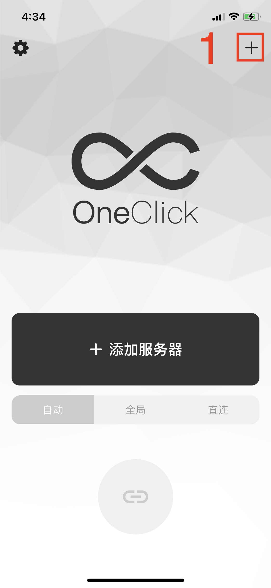
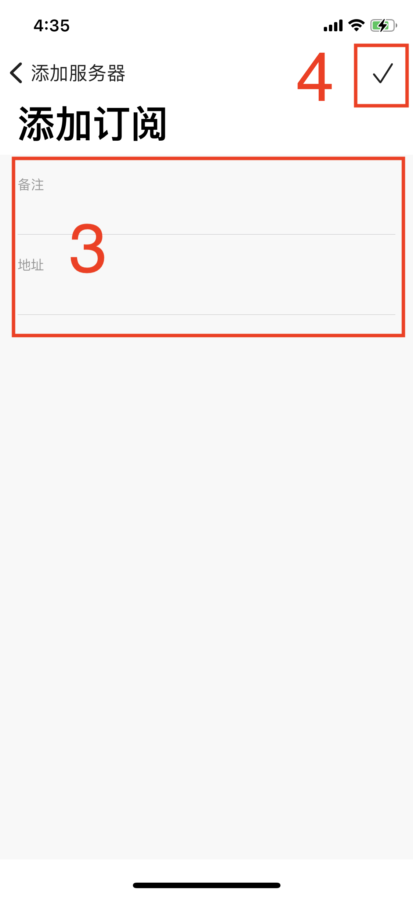
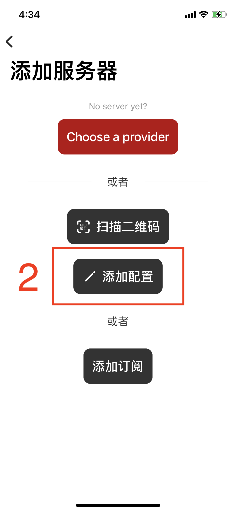
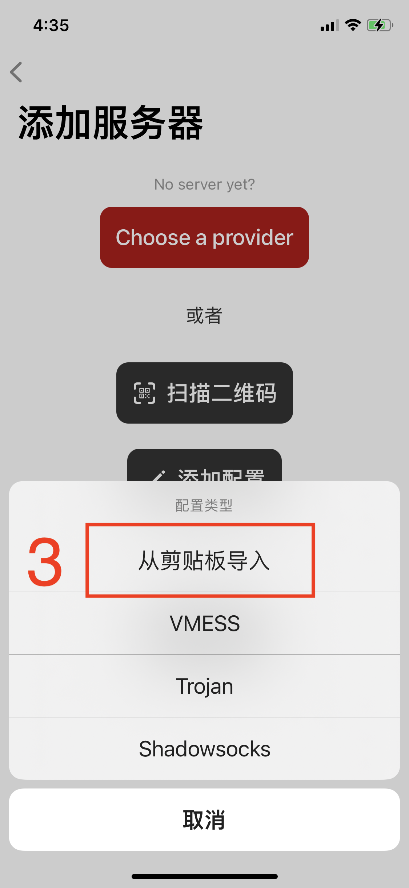
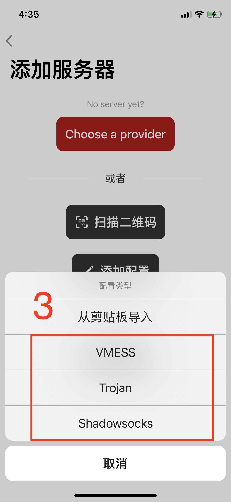
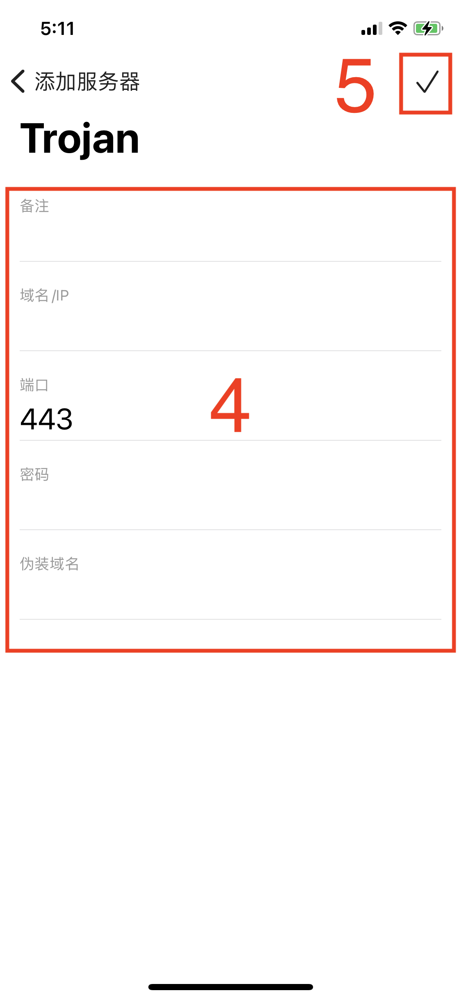
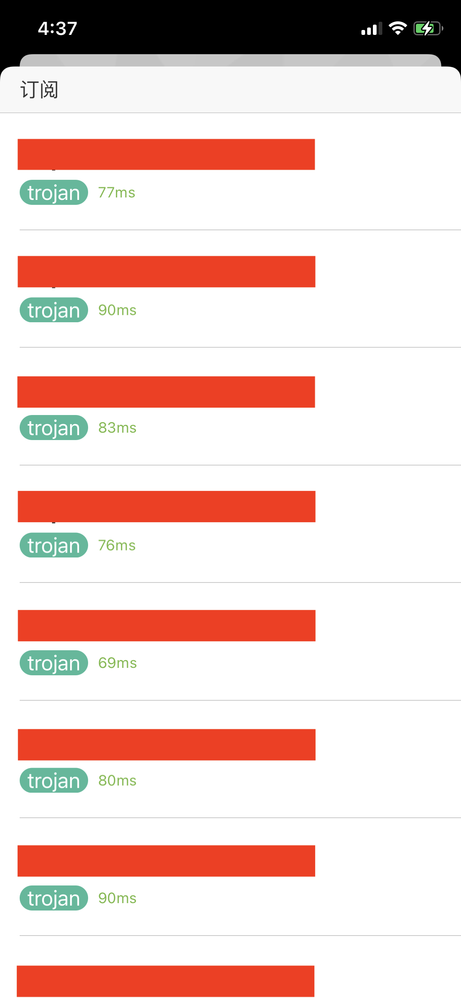
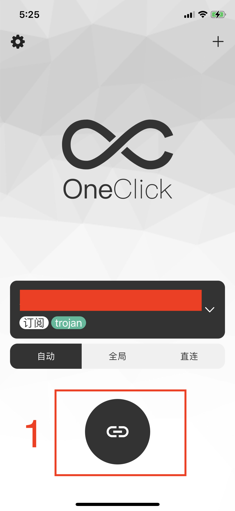

## OneClick App使用教程

#### 1. 简介
OneClick目前支持Trojan、Vmess、Shadowsocks等主流协议。

---

#### 2. 添加服务器
- **扫码添加**

进入App首页，点击右上角的“+”按钮，进入添加服务器界面，点击“扫描二维码”按钮，扫描服务器二维码信息完成添加流程。

  

- **通过订阅地址添加**

提前复制服务器的订阅地址，进入App，点击右上角的“+”按钮，进入添加服务器界面，点击“添加订阅”按钮，把复制好的订阅地址粘贴到地址栏，同时填写备注信息，最后点击右上角的确认按钮完成添加。

   

- **从剪贴板导入**

提前复制服务器的地址，进入App，点击右上角的“+”按钮，进入添加服务器界面，点击“添加配置”按钮，选择“从剪贴板导入”，即可自动导入服务器。

  

- **手动填写**

进入App，点击右上角的“+”按钮，进入添加服务器界面，点击“添加配置”按钮，选择想要添加的协议配置，填写服务器配置信息，最后点击右上角的确认按钮完成添加。

  

  

无代理服务器？点击[下单购买](https://fw321.xyz/)

---

#### 3. 选择服务器
进入App首页，点击服务器选择按钮，进入服务器列表界面，选择需要连接的服务器

 

---

#### 4. 选择代理模式

App提供自动、全局、直连模式，点击选择指定模式。

- 自动模式。自动模式是指境外的网站走代理访问，国内的网站不会通过代理服务器。
- 全局模式。全局模式是指所有网站通过代理访问，包括在国内可以直连的网站。
- 直连模式。是指所有的服务器都不走代理服务器。

---

#### 5. 连接服务器
点击App首页连接按钮，连接服务器。首次启动时会请求 VPN 权限，需要点击确定允许。

 
