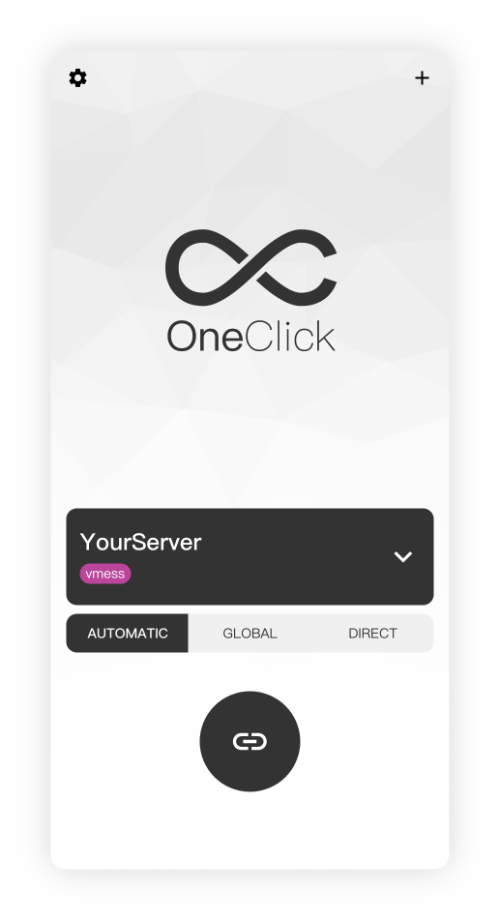

## OneClick

#### 简介

##### oneclick是一个安全、易用，免费的工具，功能如下

- 支持时下最流行的加密协议：**Shadowsocks**、**Trojan**、**Vmess** 等
- 简单操作，即可连接、导入或分享你的服务器
- 支持iOS和Android，跨平台免费使用

#### 下载地址

- [Android](https://github.com/oneclickearth/oneclick/releases)    
- [iOS](https://apps.apple.com/us/app/id1545555197)

#### 使用说明文档

> OneClick为您提供了常见问题的答疑和解决方案，您可根据本页面提供的解决方案处理问题。

#### 目录

1.[OneClick App使用教程](oneclick.md)

2.[iOS客户端下载指导文档](ios.md)

3.[安卓客户端下载指导文档](android.md)

4.[港区Apple ID注册流程](appleid.md)

	iOS用户需要非中国区的Apple 参考注册帮助，仅需10分钟完成注册
