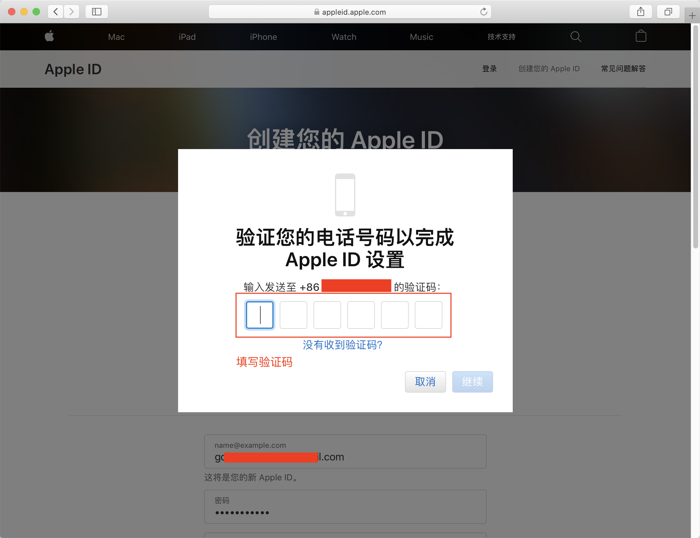
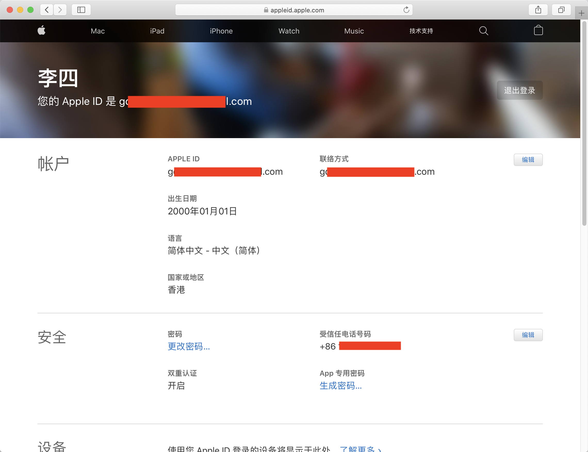
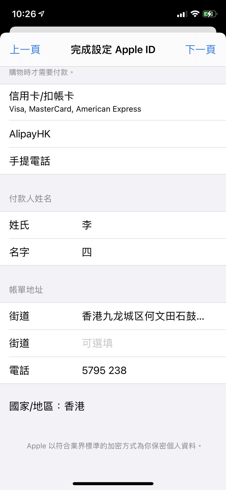

## 港区Apple ID注册流程

#### 步骤一(浏览器操作)：

1.使用浏览器访问 [https://appleid.apple.com](https://appleid.apple.com), 点击右上角```创建您的 Apple ID```链接，打开注册页面


2.填写姓名、出生日期、邮箱、密码等信息，国家或地区选择```香港```, 填写待验证的手机号码，如无香港手机号码，可以选择并填写中国大陆手机号码。


3.根据图片提示，填入验证码，然后点击下方```继续```按钮进入下一步。


4.查看电子邮箱获得邮箱验证码，并填入文本框中，点击```继续```。


5.填入手机验证码到文本框中，点击```继续```。



6.验证成功。




----

#### 步骤二(手机AppStore操作)：

1.手机打开AppStore，使用新注册的AppleId登陆


2.输入手机验证码验证


3.在弹出来的弹框中，选择```检查```


4.在下一个页面中，打开```同意条款与条件```选项开关


5.注意在该页面中，如果没有付款的需求，无需选择付款方式，然后在下方填入香港账单地址和电话（地址和电话可在[https://www.meiguodizhi.com/hk-address](https://www.meiguodizhi.com/hk-address)生成）。 填完后点击右上角的```下一页```。



6.注册完成。


7.点击或扫描下方二维码即可下载OneClick iOS客户端。

[](https://apps.apple.com/app/id1545555197)
